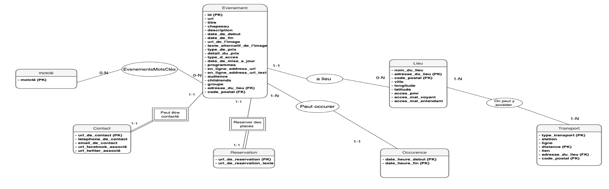

# ParisSQLModeler

**Advanced Database Modeling Project using "Que faire à Paris" Open Data**

## Overview

ParisSQLModeler is an advanced database modeling project developed during the M1 Informatique course (2023-2024). The project focuses on designing, populating, and querying a relational database built from the "Que faire à Paris" open data. Key aspects include:
- **Data Modeling & Import:** Analyzing functional dependencies, normalizing the dataset, and designing a robust relational schema with integrity constraints and indexes.
- **SQL Implementation:** Creating SQL scripts for table creation, data population, anomaly detection, and parameterized queries.
- **Open Data Utilization:** Leveraging open data from the City of Paris for a comprehensive database solution.

## Data Source

The dataset used in this project is available on the City of Paris Open Data portal:  
[Que faire à Paris Open Data](https://opendata.paris.fr/explore/dataset/que-faire-a-paris-/)

## Repository Structure

- **tables.sql** — SQL script for creating tables and indexes.
- **anomalies.sql** — SQL script for detecting data anomalies.
- **data.sql** — SQL script for executing parameterized queries to consult the data.

## Schema
